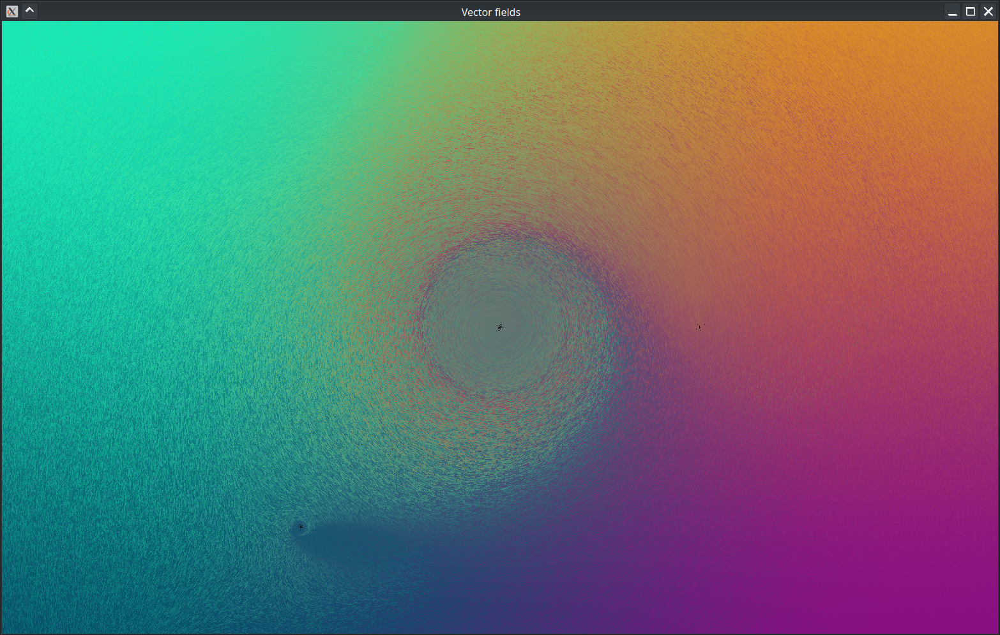

## Simple OpenGL vector field renderer utilizing a compute shader

Written mostly in October 2022. No double-buffering, no clever tricks, no nothing.

Just synchronous compute dispatch + line drawcall all on the same buffer.

